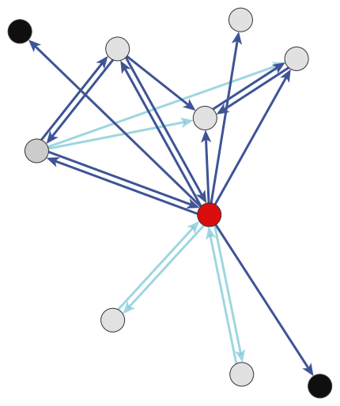
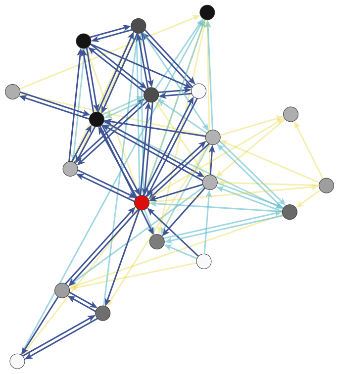

# Dynamics of Cooperative Networks Partially Attributable to Gender amongst South Indian Tamils (Simpson & Power, Under Review, Philos. Trans. R. Soc. Lond., B, Biol. Sci.)

## Abstract
Helping behaviour is thought to play a major role in the genetic and cultural evolution of group-living animals. Yet, little is known about sex-based variation in the strategies individuals use to access aid. Here we investigate whether human males and females amass supportive social bonds by differentially adhering to mechanisms of cooperation well-established by evolutionary and sociological theory (e.g., kin selection, generalised exchange). Spanning five years, our data detail gender and sources of aid for virtually all adults in two Tamil villages (782 adults [446 Women]). Simulated network dynamics (i.e., Stochastic Actor-Oriented Models) calibrated to these data indicate that women are no more or less likely than men to seek aid, call on kin, or pursue help from same-status peers. Still, women are more likely to accrue supportive bonds by utilising reciprocity, calling on friends, petitioning popular patrons, turning to same-gender peers, and building egalitarian — but not hierarchical — support groups. Findings are robust to geoposition and demographic constraints on activity (e.g., age, education, caste). And they suggest nuanced divergence in the cooperative behaviour of men and women obscured by overbroad evolutionary predictions about sex and sociality and by fixation on sex and ego-network size versus the dynamics of population-spanning networks.

 
 

a. | b.
 | 
  

_Stylised sex-homogenous egocentric networks based on evolutionary theorising of male and female sociality as, respectively, “dyadic” and “group-based”. Arcs (i.e., directed connections) indicate hypothetical aid relationships — here, to whom does one turn to for help? And arcs are coloured based on relationship type — where dark-blue arcs emanate from kin, light-blue arcs emanate from friends, and yellow arcs emanate from neither kin nor friends. Red vertices (i.e., nodes) indicate ego. Vertices for ego’s alters are coloured to reflect status relative to ego — where darker-coloured vertices are more high-status than ego, white vertices are more low-status, and grey vertices are of a similar status. *Panel a.* Prototypical female egocentric network characterised by low absolute size (i.e., few direct and indirect alters), low interconnectivity, a large degree of status homogeneity, and no supportive bonds with non-kin and non-friends. *Panel b.* Prototypical male egocentric network characterised by large absolute size (i.e., multiple direct and indirect alters), high interconnectivity and thus large ego embeddedness, a large degree of status heterogeneity, and multiple supportive bonds between kin, friends, non-kin and non-friends. Lengths of arcs, placement of vertices, and spacing between arcs/vertices are all purely aesthetic._

## Overview of Files in Replication Pack
Here, you will find two R Scripts — one master/main script entitled "Gender_Cooperative_Networks_Analysis_Tamil_Nadu.R" in addition to a companion script "Gender_Cooperative_Networks_DataPrep_Tamil_Nadu.R". The two R scripts are written to be used in conjunction with seven ".csv" files encoding the monadic, dyadic, and network data used to carry out the analyses presented in our paper. 

Because they contain sensitive information (e.g., geographic location) for a large number of adults, we have not posted the ".csv" data files here in our GitHub repository alongside our R code. To access these files, please contact the second author of our paper and the data controller Eleanor A. Power (e.a.power@lse.ac.uk) to sign an ethics and data sharing agreement, cc'ing the first author Cohen R. Simpson (c.r.simpson@lse.ac.uk). After signing this agreement, we are happy to promptly share the data files as well as our complete R workspace which contains objects for the transformed data, objects for the fitted models, and plottable objects for goodness-of-fit tests.

## R Code
We have treated both scripts a bit like running "notebooks". Accordingly, throughout the two scripts — particularly the main script — you will find code to carry out the analyses reported in the paper alongside commands used to produce useful print out (e.g., descriptive statistics, small tables, plots, etc.). Furthermore, we have left extensive comments throughout both scripts that (hopefully) give you insight into the thinking behind the decisions we take. 
 
**_After_** you have placed the seven ".csv" data files and the two R scripts in the same R working directory, installed the necessary packages, and set the number of available computing cores for your machine (see circa Line 71 of the main R script), you should be able to simply hit the "source" button in RStudio or run "source("Gender_Cooperative_Networks_Analysis_Tamil_Nadu.R")" to redo our analyses. This will also generate the text files containing the numbers used to produce Table 1 and SI Table 1. Code to generate the values in SI Table 2, SI Table 3, SI Table 4, and SI Table 5 appear in the main R script circa Lines 852-883. Both SI Table 7 and Figure 1 are created by hand.

## Executables & Packages
In addition to the R scripts, we have also included in the repository the installation files for the version of the two R packages integral to our analyses — i.e, the packages "RSiena" (https://github.com/snlab-nl/rsiena/wiki) and "groundhog" (https://groundhogr.com). Note that you may need to first install GCC (https://formulae.brew.sh/formula/gcc) — i.e., the GNU Compiler Collection — before attempting to install RSiena from source. Also, see the list of loaded packages at the very beginning of the R scripts for other short notes on dependencies that you may need to address.

For the unfamiliar, the groundhog package is a fabulous innovation that is designed to make package installation in the name of reproducible research very, very easy. Specifically, it uses the CRAN/MRAN database and date-based version control to load the packages necessary for a given set of analyses, as well as their dependencies. Please see the first 50-ish lines of the R scripts for details. Versions of RSiena are inconsistently pushed to CRAN/MRAN and thus RSiena will need to be installed from source using the file we have included here in the repository.

Finally, when re-running our analyses, some numerical results may differ slightly from those reported in the paper due to stochastic perturbations. We have used the same random seed (20180709) to ensure exact reproducibility wherever possible. However, this is not always an option depending on the function.

## Summary of Files in Repository

 1) Gender_Cooperative_Networks_Analysis_Tamil_Nadu.R (R script for data preparation and transformation)
 
 2) Gender_Cooperative_Networks_DataPrep_Tamil_Nadu.R (R script for data analyses and plotting)

 3) TN_Indiv.csv (Data on Individual Residents in Village 1 and Village 2 [Restricted Access; Data Sharing/Ethics Agreement Required])
 4) TN_Fam.csv (Data on Family Units/Households in Village 1 and Village 2 [Restricted Access; Data Sharing/Ethics Agreement Required])
 5) TN_Partnerships.csv (Data on Residents' Marital Partnerships [Restricted Access; Data Sharing/Ethics Agreement Required])
 6) TN_Kinship.csv (Data on Residents' Genetic Kin [Restricted Access; Data Sharing/Ethics Agreement Required])
 7) TN_Dist.csv (Data on Geographic Proximity Between Residents' Homes [Restricted Access; Data Sharing/Ethics Agreement Required])
 8) Ten_1317.csv (Network Data for Village 1 [Restricted Access; Data Sharing/Ethics Agreement Required])
 9) Ala_1317.csv (Network Data for Village 2 [Restricted Access; Data Sharing/Ethics Agreement Required])

 10) groundhog-1.5.0.tar.gz ("groundhog" source code used for version control for R libraries)

 11) Ripley et al. - 2021 - Manual for RSiena (v. 1.3.5).pdf [4]

 12) rsiena-1.3.5.tar.gz ("RSiena" source code used to fit Stochastic Actor-Oriented Models)

## Key Citations for Replicators
[1] Simpson, C.R. & Power, E.A. “Dynamics of Cooperative Networks Partially Attributable to Gender Amongst South Indian Tamils.” Working Paper.

[2] Power, E.A. (2017). Social Support Networks and Religiosity in Rural South India. Nature Human Behaviour, 1(3), 0057. https://doi.org/10.1038/s41562-017-0057

[3] Power, E.A. & Ready, E. (2019). Cooperation Beyond Consanguinity: Post-Marital Residence, Delineations of Kin and Social Support among South Indian Tamils. Philosophical Transactions of the Royal Society B: Biological Sciences, 374(1780), 20180070. https://doi.org/10.1098/rstb.2018.0070

[4] Ripley, R.M., Snijders, T.A.B., Boda, Z., Vörös, A. & Preciado, P. (2021). Manual for RSiena (v. 1.3.5) [R]. http://www.stats.ox.ac.uk/~snijders/siena/RSiena_Manual.pdf

## Notes
1) Thank you for your interest in our work! Please do let us know if something goes wrong. We are more than happy to help and you can always email us.

